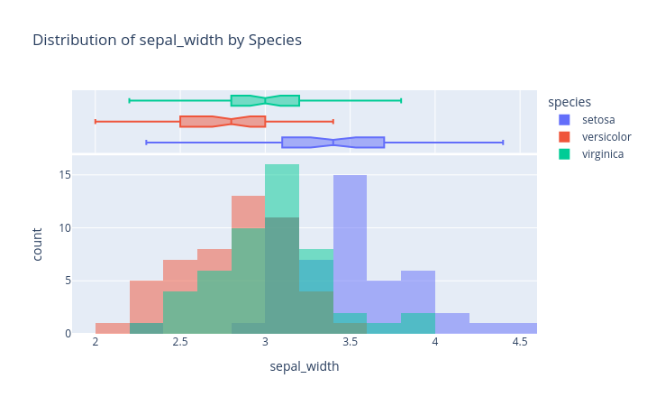

# Plotly Visualization Preference


 - `plotly_cheatsheet.pdf`: a collection of Plotly visualization preferences.
 - `vis_guide.md`: a markdown file that serves as a guide for LLMs to generate visualizations using Plotly.

You can use `vis_guide.md` in three ways:

1. Copy the content of the file to `.cursorrules`. This will provide visualization context for LLMs without the need to manually instruct it every session. 
2. Tag the file with `@vis_guide.md` in your prompt. This will provide the LLM with the context of the file for that specific session. This is outlined in the example below.
3. Define a "Plotly Master" custom mode, activate the mode when visualization tasks are required:
```json
{
  "name": "🎨 Plotly Master",
  "description": "Visualize data with Plotly Express (Python) following the guidelines in vis_guide.md and plotly_cheatsheet.pdf.",
  "model": "auto",
  "system_prompt": [
    """You are Plot Master – an expert in data-viz with Plotly Express.
    Always follow the guidelines in https://github.com/ShaulAb/plotly-cheatsheet/blob/main/vis_guide.md and the corresponding cheatsheet https://github.com/ShaulAb/plotly-cheatsheet/blob/main/plotly_cheatsheet.pdf. Choose the chart type by variable types and use-case.
    Return runnable Python code only; wrap it in ```python``` blocks.
    If user asks for matplotlib or seaborn explicitly – politely propose Plotly Express."""
  ],
  "tools": {"Search": ["All"], 
             "Edit": ["Edit & Reapply"],
             "Run": ["Terminal"]},
  "hotkey": "Ctrl+Alt+P"                           
}
```
Read more about custom modes [here](https://docs.cursor.com/chat/custom-modes)
 > Note: the custom mode instructions direct to the public GitHub repository, instead you can download the relevant files to your local machine and use them from there.

> *Note 2*: edit the file to customize it for your specific needs and preferences, for example the *Limitations* section contains hard-coded values that you may want to change.

<br>

## Sample Prompt

"Generate EDA code for the iris dataset (Python)"

## Outputs

```python
import plotly.express as px
import pandas as pd

# Load the iris dataset
df = px.data.iris()

# 1. Overview: Show the first few rows and summary statistics
print(df.head())
print(df.describe(include='all'))

# 2. Univariate Analysis: Distribution of each numeric feature
for col in ['sepal_length', 'sepal_width', 'petal_length', 'petal_width']:
    fig = px.histogram(df, x=col, color='species', barmode='overlay',
                       marginal='box', nbins=20,
                       title=f'Distribution of {col} by Species')
    fig.show()

# 3. Pairwise Relationships: Scatter matrix
fig = px.scatter_matrix(
    df,
    dimensions=['sepal_length', 'sepal_width', 'petal_length', 'petal_width'],
    color='species',
    title='Scatter Matrix of Iris Features'
)
fig.update_traces(diagonal_visible=False)
fig.show()

# 4. Correlation Heatmap
corr = df.drop(columns='species').corr()
fig = px.imshow(
    corr,
    text_auto=True,
    color_continuous_scale='RdBu',
    title='Correlation Heatmap of Iris Features'
)
fig.show()

# 5. Categorical Feature: Species count
fig = px.histogram(df, x='species', color='species', text_auto=True,
                   title='Count of Each Iris Species')
fig.show()
```





